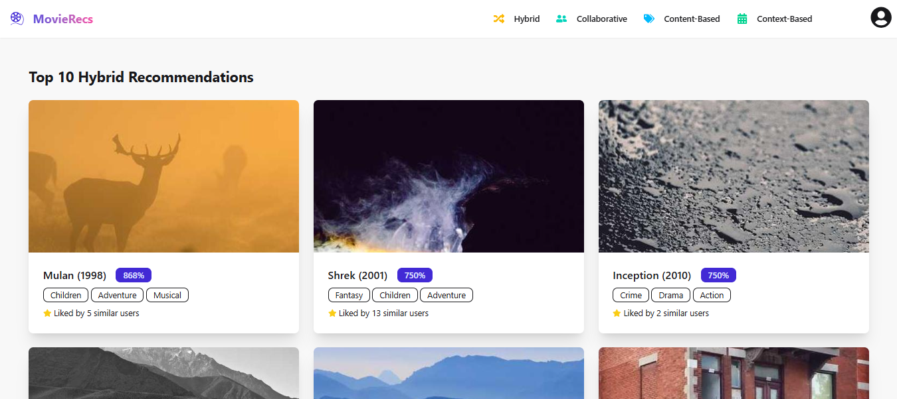
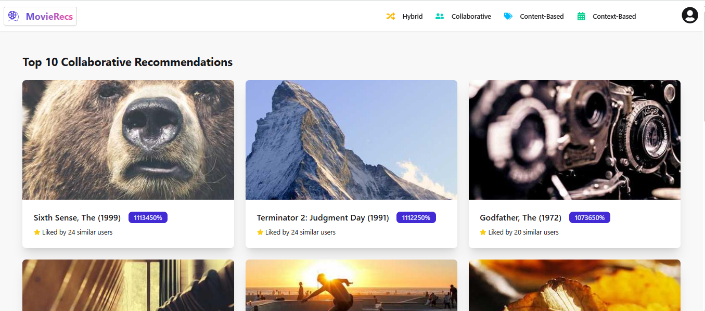
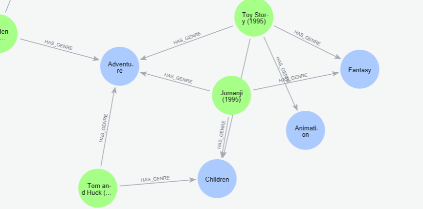
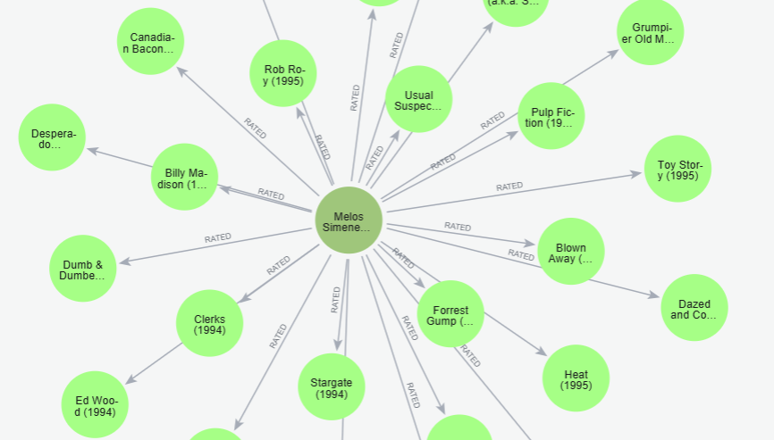

# 🎬 Neo4j Movie Recommendation System

A full-stack movie recommendation system powered by **Neo4j**, with a **FastAPI** backend and a **React** frontend. It uses the [MovieLens (ml-latest-small)](https://grouplens.org/datasets/movielens/latest/) dataset to deliver personalized recommendations using **collaborative**, **content-based**, **context-aware**, and **hybrid** filtering techniques.

## 🧠 Features

- Four recommendation strategies (collaborative, content, context, hybrid)

- Recommendation explanations

- REST API with interactive docs

- Neo4j schema constraints, indexes, and initial data loading

## 🔍 Recommendation Techniques Explained

This system supports four types of movie recommendations:

### 1. 🎭 Collaborative Filtering

- **Idea**: Recommends movies liked by users with similar tastes.

- **Similarity Metric**: [Jaccard similarity](https://en.wikipedia.org/wiki/Jaccard_index) between users based on their rated movies.

- **Scoring**:

  - The more overlap between users' ratings, the stronger the similarity.
  - Movies rated by similar users (but not yet rated by the target user) are recommended.

    \[
    \text{Jaccard Similarity} = \frac{|A \cap B|}{|A \cup B|}
    \]

    Where:

    - \(A\) = set of items rated by User 1
    - \(B\) = set of items rated by User 2
    - \(|A \cap B|\) = number of items both users rated (intersection)
    - \(|A \cup B|\) = total number of unique items rated by either user (union)

- **Cypher Technique**: Uses intersection/union of movies between users with `apoc.coll.intersection` and `apoc.coll.union`.

### 2. 🎨 Content-Based Filtering

- **Idea**: Recommends movies that are similar to the ones the user has rated highly.

- **Similarity Factors**:

  - **Genres** (e.g., Action, Comedy)
  - **Tags** (e.g., "time travel", "based on novel")

- **Scoring Formula**:
  \text{score} = (1.5 \times \text{#shared genres}) + (1 \times \text{#shared tags})

- **Focus**: Personal preferences derived from user’s past high-rated movies (rating ≥ 4).

### 3. ⏳ Context-Based Filtering (with Recency)

- **Idea**: Weighs recent ratings more than old ones.

- **Recency Weighting Formula:**
  \[
  \text{recencyWeight} = e^{-\lambda \times \text{daysSinceRating}}
  \]

  - Recent ratings have more influence on recommendation outcomes.

- **Additional Factors**:

  - Recent average rating
  - Number of users who rated the movie recently

- **Goal**: Prioritize currently trending or actively watched movies.

### 4. ⚡ Hybrid Recommendation

- **Idea**: Combines collaborative, content-based, and context-aware techniques.
- **Combined Score**:

  - Weighted mix of collaborative similarity, content match, and recency-adjusted scores.

- **Features**:

  - Identifies **top contributors** (users who influenced the recommendation)
  - Tracks overlapping **genres** and **tags** to enhance explainability

- **Best For**: Balanced, personalized recommendations blending **user preference**, **popularity**, and **recency**.

### 🧾 Explainability

- **Endpoint**: `GET /explain/{user_id}/{movie_id}`

- Provides a human-readable explanation of **why a movie was recommended**, including:

  - Shared ratings with similar users
  - Genre and tag overlaps
  - Time since it was last rated

## Screenshots

### Frontend UI

#### 🔐 Login Page


### 🧩 Hybrid Recommendation



### 👥 Collaborative Recommendation



### 🧠 Neo4j Graph Visualizations

#### 🎞 Movie → Genre



### ⭐ User → Movie (RATED)



### 🏷 User → Tag + Movie → Tag


## 🧬 Data Model (Relationships Overview)

```text
(:User)-[:RATED {rating, timestamp}]->(:Movie)

(:User)-[:TAGGED {timestamp}]->(:Tag)

(:Movie)-[:HAS_GENRE]->(:Genre)

(:Movie)-[:HAS_TAG]->(:Tag)
```

## 📁 Project Structure

neo4j-movie-recommender
├── backend/ # FastAPI backend for recommendation APIs
├── frontend/ # React frontend UI
├── dataset/ # MovieLens dataset (movies.csv, ratings.csv etc.)
├── db/ # Neo4j Docker Compose config and init scripts
└── README.md # Project overview

## 🚀 Tech Stack

| Component | Tech                        |
| --------- | --------------------------- |
| Backend   | FastAPI, Python 3.10+       |
| Frontend  | React (JavaScript)          |
| Database  | Neo4j (via Docker Compose)  |
| Dataset   | MovieLens (ml-latest-small) |

## 🔧 Setup Instructions

### 1. Clone the Repository

```bash
git clone https://github.com/melos-simeneh/neo4j-movie-recommender.git
cd neo4j-movie-recommender
```

### 2. Set Up Neo4j (Database)

Navigate to the db/ folder and start the Neo4j container:

```bash
cd db
docker-compose up -d
```

- The dataset will be loaded automatically via `init.cypher`
- Access Neo4j browser at [http://localhost:7474](http://localhost:7474)
- Default credentials: `neo4j / Test@1234`

### 3. Run the Backend (FastAPI)

In a new terminal:

```bash
cd backend
python -m venv venv
source venv/bin/activate  # or venv\Scripts\activate on Windows
pip install -r requirements.txt
uvicorn main:app --reload  --port 3001
```

API Docs available at: [http://localhost:3001/docs](http://localhost:3001/docs)

### 4. Run the Frontend (React)

If frontend is set up:

```bash
cd frontend
npm install
npm run dev
```

- Visit: [http://localhost:5173](http://localhost:5173)

## 📡 API Features

- `POST /login` – Authenticate a user

- `GET /users` – List users

- `GET /movies` – List movies

- `GET /recommend/collaborative/{user_id}` – Collaborative filtering

- `GET /recommend/content-based/{user_id}` – Content-based filtering

- `GET /recommend/context-based/{user_id}` – Context-aware recommendation

- `GET /recommend/hybrid/{user_id}` – Hybrid recommendation

- `GET /explain/{user_id}/{movie_id}` – Explain why a movie was recommended

## 🗃 Dataset

Using the `ml-latest-small version` of MovieLens, which includes:

- `movies.csv`

- `ratings.csv`

- `tags.csv`

- `links.csv`

In addition, a `users.csv` file was generated using a Python script located at:

```bash
backend/utils/generate_users_csv.py
```

This script generates mock user profiles for existing user IDs.

## 👨‍💻 Author

Built with 💚 by **`Melos`**
